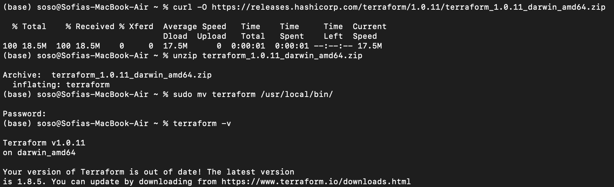
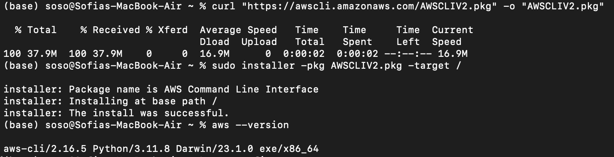
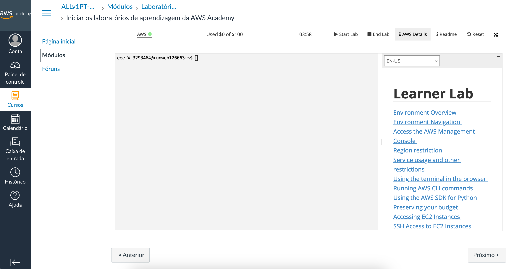
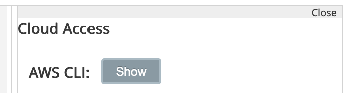
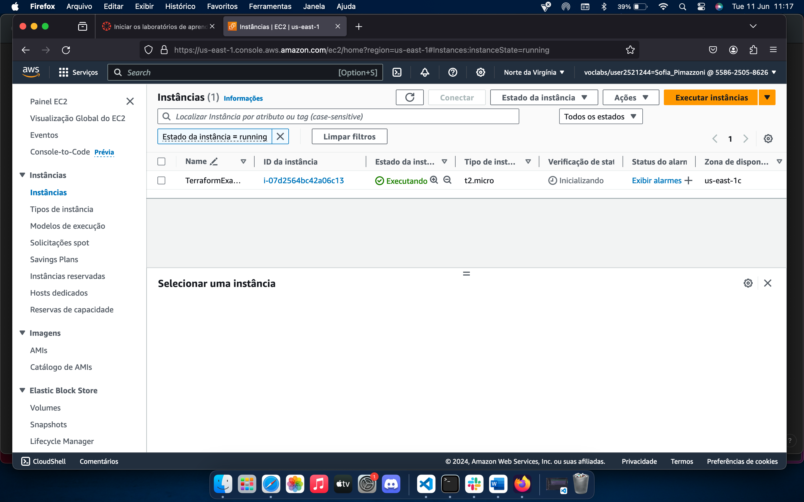
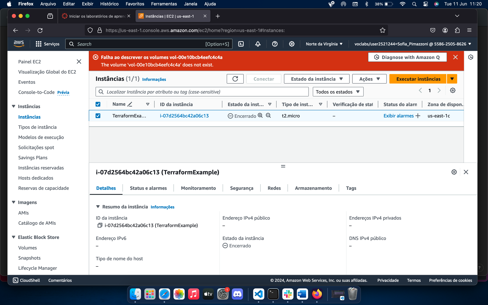

# Tutorial: criação de EC2 na AWS utilizando o Terraform no MacOS

Eai pessoal! Nesse tutorial vou explicar o passo a passo pra se criar uma EC2 na AWS de forma automatizada utilizando o Terraform no MacOS. Caso você não saiba, o Terraform uma ferramenta de IaC (Infraestrutura como Código) que permite definir, provisionar e gerenciar recursos de infraestrutura em várias plataformas de nuvem.

Antes de começar, existem dois pré-requisitos que precisam ser cumpridos:
- possuir uma conta no [AWS Academy](https://awsacademy.instructure.com/);
- após entrar na sua conta, inicie o laboratório da AWS;

Prontinho! Agora podemos começar de verdade :)

## Passo 1: instalação de dependências

Primeiro, é necessário instalar o TerraformCLI, para isso, abra o terminal (não precisa mudar de diretório, pode baixar no root):

- baixe o Terraform com o comando:
```bash
curl -O https://releases.hashicorp.com/terraform/1.0.11/terraform_1.0.11_darwin_amd64.zip
```

- extraia o arquivo ZIP: 
```bash
unzip terraform_1.0.11_darwin_amd64.zip
```

- mova o binário para o diretório `/usr/local/bin` para torná-lo acessível globalmente:
```bash
sudo mv terraform /usr/local/bin/
```

- verifique a instalação:
```bash
terraform -v
```

Caso o seu terminal esteja mais ou menos assim, você ta no caminho certo:

<p align="center">
    
    </br>
</p>


Segundo, é preciso instalar o AWS CLI, e pode seguir no mesmo terminal e diretório que o Terraform:

- baixe o instalador do AWS CLI com o comando:
```bash
curl "https://awscli.amazonaws.com/AWSCLIV2.pkg" -o "AWSCLIV2.pkg"
```

- instale o AWS CLI:
```bash
sudo installer -pkg AWSCLIV2.pkg -target /
```

- verifique a instalação:
```bash
aws --version
```

Ufa! Instalamos tudo, e o seu terminal deve estar mais ou menos assim:

<p align="center">
    
    </br>
</p>

## Passo 2: configurando as credenciais da AWS

Agora precisamos configurar as credenciais da AWS. Lembra que o seu laboratório já está rodando? Então, é lá mesmo que você vai buscar as informações.

- clique em AWS Details no canto superior direito:

<p align="center">
    
    </br>
</p>

- depois, clique em "show":

<p align="center">
    
    </br>
</p>

Feito isso, deixe essa aba aberta e volte para o seu terminal. Ainda no root, execute os comandos a seguir:

- configurar as credenciais da AWS:
```bash
aws configure
```
Ele vai te pedir os dois primeiros tokens, que você copia e cola do laboratório da AWS, a região, que provavelmente será `us-east-1` e a última opção você pode deixar em branco (só da enter).

Beleza, agora é preciso configurar os tokens diretamente no arquivo de credenciais:

- caminhe até o diretório a seguir:
```bash
cd ~\.aws\
```

- crie e edite o arquivo `credentials`:
```bash
nano ~/.aws/credentials
```

Você deve escontrar algo parecido com isso:
```bash
[default]
aws_access_key_id = YOUR_ACCESS_KEY_ID
aws_secret_access_key = YOUR_SECRET_ACCESS_KEY
```

Substitua as variáveis pelos seus valores e adicione o último token:
```bash
aws_session_token = YOUR_SESSION_TOKEN
```

Para sair e salvar execute `CNTRL X`, `y` e aperte enter.

## Passo 3: criar um diretório com o arquivo `main.tf`

- crie um diretório e navegue até ele:
```bash 
mkdir nome_a_sua_escolha
```
```bash 
cd nome_a_sua_escolha
```

- crie um arquivo de configuração Terraform chamado `main.tf` com o seguinte conteúdo:
```
provider "aws" {
  region = "us-east-1"
}

resource "aws_instance" "example" {
  ami           = "ami-0c02fb55956c7d316"  # Amazon Linux 2 AMI (HVM), SSD Volume Type
  instance_type = "t2.micro"

  tags = {
    Name = "TerraformExample"
  }
}
```

Perfeito! Agora você tem tudo pronto pra o próximo passo. 

## Passo 4: rodar o Terraform

Tá na hora de ficar feliz, porque agora só falta rodar o Terraform e ver a mágica acontecer. Execute os seguintes comandos dentro do diretório criado:

- inicialize o Terraform:
```bash
terraform init
```

- crie um plano de execução para revisar as ações que o Terraform irá executar:
```bash
terraform plan
```

- aplicar o plano para criar a instância EC2:
```bash
terraform apply
```

- verifique a criação da instância EC2 na interface da AWS:

<p align="center">
    
    </br>
</p>

- por último, você não quer essa instância gastantando todo o seu crédito da AWS certo? Então é preciso destruí-la:

```bash
terraform destroy
```

<p align="center">
    
    </br>
</p>

## Conclusão

Prontinho, agora você já sabe como criar instâncias na AWS de forma automatizada no MacOS!

